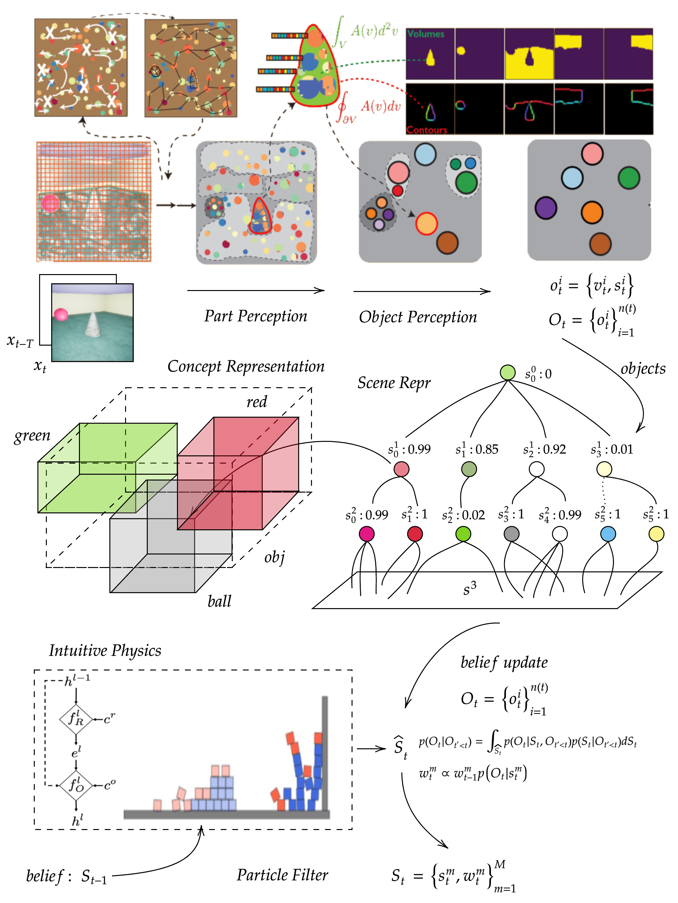
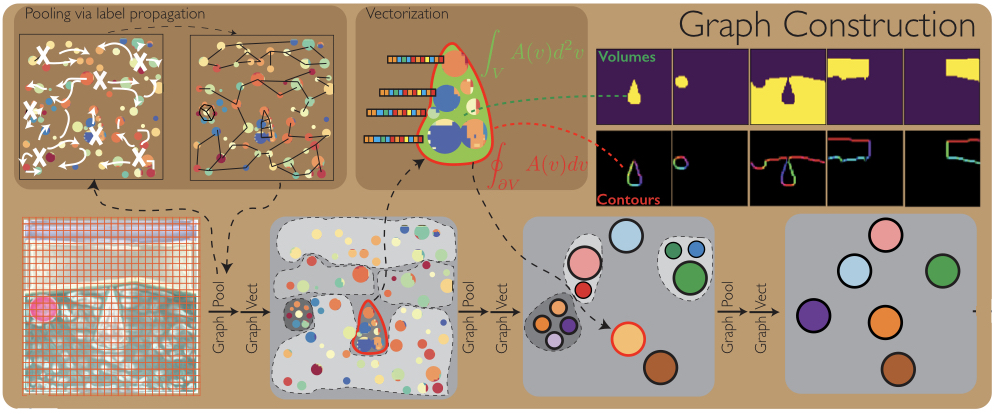
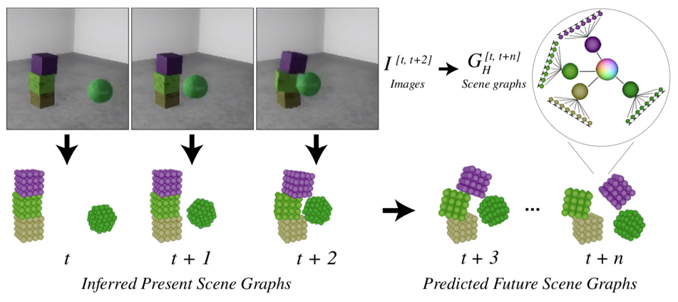
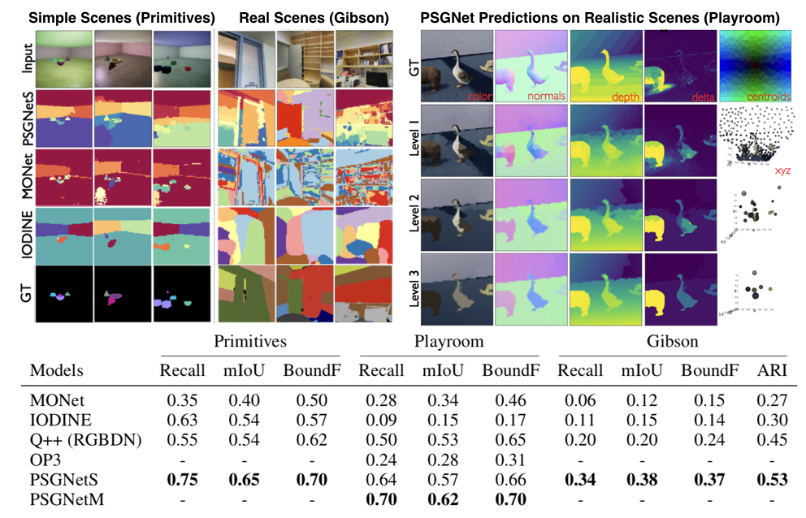

# Hierarchical Scene Graph Learner
 Grounding Visual Hierarchy using Natural Language

This repo is the Hierarchical Concept Learner



# Physical Scene Graph Network
This repo is trying to reproduce the project "Learning Physical Graph Representations from Visual Scenes". Apply Gestalt principles in unsupervised 
visual scene understanding.
Computer vision researchers have not yet developed algorithms that capture human physical understanding of scenes. This is despite outstanding progress in capturing other visual abilities: in particular, convolutional neural networks(CNNs) supervised with human-labeled data have excelled at categorizing scenes and objects. Yet when CNNs are optimized to perform tasks of physical understanding, such as predicting how a scene will evolve over time, the may unrealistic predictions - of objects dissolving, disappearing, or merging. Being able to tell a cat from a dog is not the same as knowing that a dog will still exist and keep its form when it runs out of sight.

[[Paper]](https://arxiv.org/pdf/1904.11694.pdf)
[[Project Page]](https://sites.google.com/view/neural-logic-machines)

When we look at a scene we see distinct object imbued with *physical properties*: color, texture, location, shape, motion, and so on. We also infer complex and dynamical relationships within the scene: a cup may be balanced precariously on table's edge, a piece of debris may be rolling in front of a truck, or a dog may have temporarily disappeared behind a tree. All of these judgements involve physical understanding of out visual observations.

## Representation of Physical Scene Graph

The need to understand physical objects suggests a different type of scene representation than the image-like layers of features found in CNNs. Instead, different objects might be represented by distinct entities with associated attributes and interelationships--in other words, a graph representation. We formalize this idea as a Physical Scene Graph (PSG): a hierarchical graph in which nodes represent objects or their parts, edges represent relationships, and a vector of physically meaningful attributes is bound to each node,
## Visual Feature Extraction

Unlike the task of inferring scene structure, CNNS are already good at extracting geometric features - they just do not group these features into discrete objects. However, different types of geometric information are typically found in different CNN layers: early layers can encode sharp object boundaries, whereas later layers better encode board-scale information about depth and surface shape. To combine both types of information in a single set of features, we developed a recurrent CNN (ConvRNN) that learns to combine early and late layers through locally recurrent "cells" and long-range feedback connections. As expected, this recurrent feature extraction architecture is mainly cruicial for learning to represent geometric properties: lower-level visual properties, like color and texture, are laregely unaffected by instead using a feedforward CNN feature extractor.
Of course I didn't write the ConvRNN in the repo because I didn't find the pytorch version for this network. I used a residual dense network to replace the feature extractor and it looks fine.

## Cluster and Graph Pooling


The general framework for the graph pooling and clustering layer is here. Different layers have different kinds of grouping mechansim that corresponds to gestalt principles which will be discussed in detail later.

```py
def forward(self, x, edge_index, batch, device=device):
    row, col = edge_index
    # Collect affinities/thresholds to filter edges 

    affinities, threshold, losses = self.affinities_and_thresholds(x,row,col)

    if self.Type == "P1":filtered_edge_index = edge_index[:, affinities <= threshold]
    if self.Type == "P2":filtered_edge_index = edge_index[:, affinities >= threshold]
            
    # Coarsen graph with filtered adj. list to produce next level's nodes
    x = x.to(device)

    if x.size(0) != 0:
        try:
            node_labels    = LP_clustering(x.size(0), filtered_edge_index, 40).to(device)
        except:
            node_labels = torch.arange(x.size(0))
    else:
        node_labels = torch.arange(x.size(0))
        

    cluster_labels = node_labels.unique(return_inverse=True,sorted=False)[1].to(device)

    coarsened_x, coarsened_batch = max_pool_x(cluster_labels, x, batch)

    # [Very Suceptible Step, Why use this way to coarse edges]
    coarsened_edge_index = coalesce(cluster_labels[filtered_edge_index],
                              None, coarsened_x.size(0), coarsened_x.size(0))[0]

    return (coarsened_x, coarsened_edge_index, coarsened_batch,
                                                         cluster_labels, losses)
```
To construct new parent edges, nodes are clustered according to within-layer
edges from one of the four affinity functions using the standard Label Propagation (LP) algorithm [44]
(Fig. S1 left, middle column.) This algorithm takes as input only the edges El
, the number of nodes at
the current graph level |Vl
|, and a parameter setting the number of iterations. Each node is initialized
to belong in its own cluster, giving a set of labels [|Vl
|]. Then for q > 0, iteration-q labels are
produced from iteration q − 1-labels by assigning to each node v ∈ Vl
the most common stage-q − 1
label among nodes connected to v by an edge. Ties are resolved randomly. Let Pl
: Vl → [m] denote
the final converged label-prop assignment of nodes in V to cluster identities, where m is the number
of clusters discovered. Effectively, the new child-to-parent edges Pl define input-dependent pooling
kernels for Vl (Fig. S1 Left, right column.) The final stage of building a new PSG level, Graph
Vectorization, uses these pooling kernels to aggregate statistics over the resulting partition of Vl
,
resulting in new nodes Vl+1 with |Vl+1| = m (see below.)
```py
def LP_clustering(num_nodes,edge_index,num_iter=50,device=device):

    # Sparse adjacency matrix
    adj_t = SparseTensor(row=edge_index[0], col=edge_index[1],value = torch.ones_like(edge_index[1]).float(),
                         sparse_sizes=(num_nodes, num_nodes)).t().to(device)

    # Each node starts with its index as its label
    x = SparseTensor.eye(num_nodes).to(device)

    for _ in range(num_iter):


        # Add each node's neighbors' labels to its list of neighbor nodes
        out = adj_t @ x
        # Argmax of each row to assign new label to each node
        row, col, value = out.coo()

        argmax = scatter_max(value, row, dim_size=num_nodes)[1]

        new_labels = col[argmax]
        x = SparseTensor(row=torch.arange(num_nodes).to(device), col=new_labels,
                            sparse_sizes=(num_nodes, num_nodes),
                            value=torch.ones(num_nodes).to(device))

    return new_labels
```

Four types of graph cluster methods are introduced in the paper. Here are some implemenatations of these concepts.

**Principle-1**:This is the implementation for the principle-1 of visual grouping. 

An affinity function differs from the original paper is applied in this repo. In this repo, we calculate the norm of differences between a pair of nodes and determines whether connect this pair by looking at the mean difference of a certain window (3 or 5). Let $v = A_l(v)$ denote the attribute vector associated with node $v$ at graph level $l$ (without the time-index and spatial features like centroids and moments). The the P1 affinity between two nodes $v,w$ is the reciprocal of their $L_2$ distance, gated by a binary spatial window
```math
D^1(v,w) = \frac{1(|c(v) - c(w)| < \delta)}{||v-w||_2}
```
where $c(v)$ is the centroid of node $v$ in $(i,j)$ coordinates given by its spatial window registration and $|\dot|_m$ denotes Manhattan distance in the feature grid. The P1 affinities are thresholded by the reciprocal of their local averages,
```math
\epsilon^1(D^1(v),D^1(w)) = \min(\frac{1}{\overline{D}^1(v)},\frac{1}{\overline{D}^1(w)})
```
The principle produce edges between nodes in the spatial window that has feature difference smaller than or equal to average feature differences.

```py
def affinities_and_thresholds(self, nodes, row, col):
    # Norm of difference for every node pair on grid
    edge_affinities = torch.linalg.norm(nodes[row] - nodes[col],dim = 1) 

    # Inverse mean affinities for each node to threshold each edge with
    inv_mean_affinity = scatter_mean(edge_affinities, row.to(nodes.device))
    affinity_thresh   = torch.min(inv_mean_affinity[row],
                                      inv_mean_affinity[col])
    return edge_affinities.to(device), affinity_thresh.to(device), {}
```

**Principle-2**:This is the implementation for the principle-2 for visual grouping. This layer corresponds to the gestalt principle of statistical cooccruence.
The idea behind this layer is that if two nodes appear often in the same pairwise arrangement, it may be because they are part of an object that moves (or exists) as a coherent whole. Thus it is away of trying to infer motion-in-concert without actually observing motion, as when visual inputs are single frames. This is implemented by making $D^2_{\phi}(v,w)$ inversely proportional to the reconstruction loss of the node pair a variational autoencoder (VAE). Denote the VAE as $\phi_2$, so the that common nodes attributes pairs will tend to be reconstructed better than rare pairs. Further, to perserve the input symmetry.
```math
e_{vw} = |v-w|
```
```math
e'_{vw} = H_{\phi_2}(e_{vw})
```
the input features are differences between node features. Another possibility for this symmetry design will be using GNN like message passing model to gain output but that is for future work. The P2 affinity of a node pair is given by the equation.
```math
D^2(v,w) = \frac{1}{1 + v_2 |e_{vw} - e'_{vw}|_2}
```
```py
self.node_pair_vae = VAE( in_features=node_feat_size ,beta = 30) # layer specified

def affinities_and_thresholds(self, x, row, col):

    # Affinities as function of vae reconstruction of node pairs
    _, recon_loss, kl_loss = self.node_pair_vae( x[row] - x[col] )
    edge_affinities = 1/(1 + self.v2*recon_loss)

    losses = {"recon_loss":recon_loss.mean(), "kl_loss":kl_loss.mean()}

    return edge_affinities, .5, losses
```

These affinity functions and corresponding thresholds are 

## Graph Node Render
This paper use the quadratic texture rendering and quadratic shape rendering to output the reconstruction signal and segmentation signal. In this repo, after each layer' nodes' attributes are calculated, we implement a fully connected network to decode the parameters for the final rendering.

**Quadratic Texture Rendering**
Give the node attributes of layer of a PSG, together with the spatial registration (spatial region) $R_l$ it corresponds, the quadratic texture rendering (**QTR**) creates a spaitial map by inpaining the value of an attribute for node $v$ onto the pixels in $R_l(v)$. However, rather than paint uniformly throughout $R_l(v)$, QTR paints quadratically. Given 6 parameters of a quadratic form $a,a_h,a_w,a_{hh},a_{ww},a_{hw}$, it paints the corresponding spatial registration using the form 
```math
qtr(i,j) = a+a_h(i-c^v_h)+a_w(j-c^v_w)+\frac{1}{2}a_{hh}(i-c^v_h)^2+\frac{1}{2}a_{ww}(j-c^v_w)^2+\frac{1}{2}(i-c^v_h)(j-c^v_w).
```
implementation of this paint by numbers is shown here.
```py
def QTR(grid,center,a,ah,aw,ahh,aww,ahw):
    ch,cw = center
    mx,my = grid[:,:,0],grid[:,:,1]
    var = a + ah*(mx - ch) + aw*(my - cw) +\
        ahh*(mx - ch)**2 + aww*(my - cw)**2 + ahw * (mx - ch) * (my - cw)
    return var

```

**Quadratic Shape Rendering**
We define quadratic shape rendering (QSR) to produce a shape from node attributes, elaborating a procedure developed in previous papers, given parameters $p^d_x,p^d_y,p^d_{\rho},p^d_{\alpha}$. Let
```math
 qsr^d(x,y)=\sigma(p^d_{\alpha}[\cos (p^d_\rho) - x\sin(p^d_\rho) - p^d_x]^2) - [x\cos(p^d_\rho) + y\sin(p^d_\rho - p^d_y)]
```
where $\sigma$ is the standard sigmoid function and the overall segmentation will be $qsr[i,j] = \min_d qsr^d(i,j)$. The equation can be interpreted as using $D$ quadratic curves to draw shapes.

## Furture Prediction
The key next step is to use the physical graph representation for tasks that flummox other computer algorithms - tasks that require physical understanding more than categorical knowledge. Whether an object will slide or roll, how soon two things will collide, and where to look for something hidden are problems that depeond on just the sort of scene structure and physical properties that PSGNets encoder. By learning to build structure, physical representations of scenes, we hope that PSGNets will begin to bridge the critical gap between visual perception and physical understanding.


## Results
Here are some results collected in the scene from the paper. Results from this repo will come out soon.



## Future Works
This project contains.